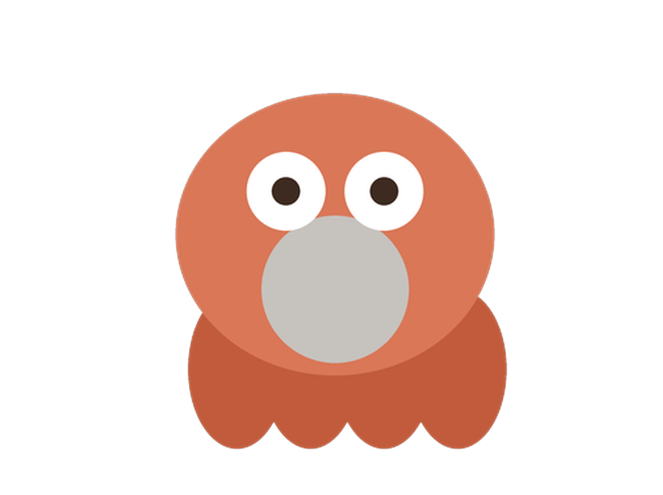
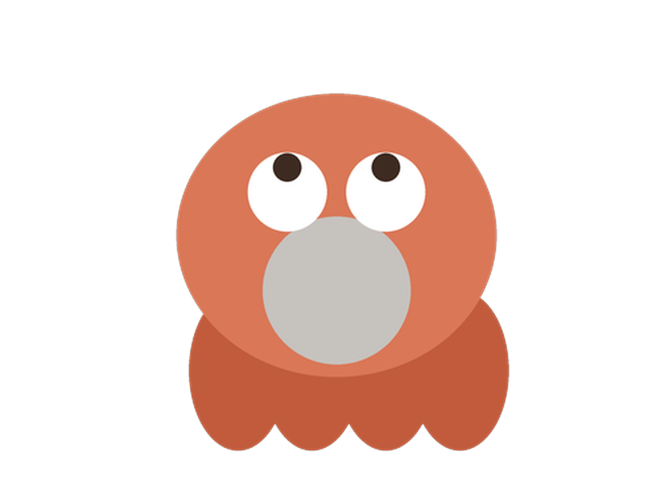
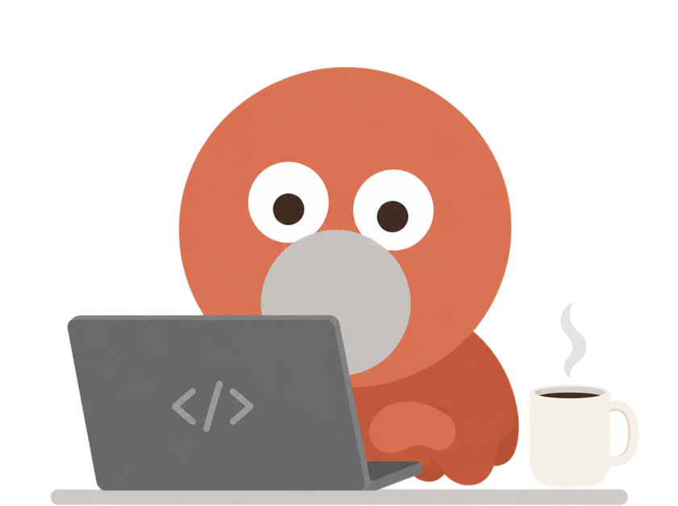
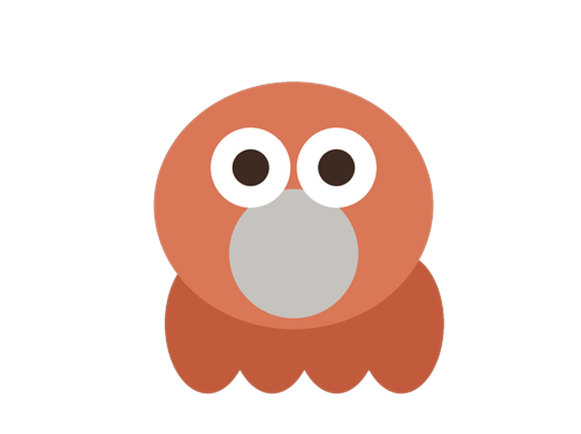
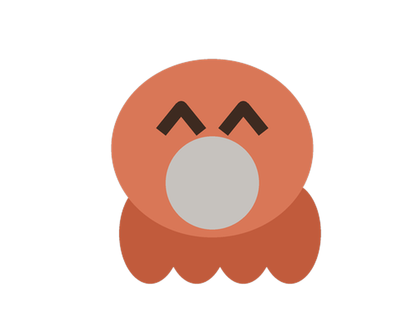

# 🐙 Octopus — 盯着 Claude Code 的桌面宠物

> 一只趴在你屏幕角落的小章鱼，实时把 **Claude Code** 正在干什么"演"给你看：
> 思考、干活、等你授权、完成庆祝、打瞌睡——顺便帮你把 **token 花了多少钱** 也算清楚。

<p align="center"></p>

### 形象 × 状态

宠物用表情告诉你 Claude Code 此刻在做什么——余光扫一眼就懂：

| 形象 | 状态 | 什么时候出现 |
|:---:|:---|:---|
|  | 🤔 **思考** | 你刚提交提问、Claude 正在想，或等你回复输入时 |
|  | 🛠️ **干活** | 正在调用工具 / 改文件（对着笔记本敲代码 + 咖啡） |
|  | ✋ **等你授权** | 需要你点「允许 / 拒绝」时瞪大眼看你（出错时也用它） |
|  | 🎉 **完成庆祝** | 一轮任务干完，笑眼 ^^；新会话打招呼也用它 |
|  | 😴 **待命 / 睡觉** | 没有任务时闭眼待命；长时间无活动进入睡眠 |

> 状态机里其实还细分了 `talking / juggling(并行子任务) / sweeping(清理上下文) / greet / error …` 等更多态，
> 目前先并到上面这几张主表情上显示。完整状态与触发逻辑见 [`STATES.md`](../STATES.md)。

### 月薪喵皮肤 × 状态

第三款皮肤「月薪喵」🐱（猫 meme 表情包，原作者：抖音 [@月薪喵](../assets/cat/CREDITS.md)），每个状态一张 GIF，覆盖了完整的 14 个细分状态：

| 表情 | 状态 | 什么时候出现 |
|:---:|:---|:---|
|     | 🛠️ **working 干活** | 正在调用工具 / 改文件——4 张打工姿态轮换：拍「上号」按钮 / 熬夜冠军 / 捂耳猛敲 / 边吃边敲 |
|   | 🤔 **thinking 思考** | 提交提问后 / 工具间隙的长推理——思考姿态轮换：挠头 / 躺想浮云 |
|  | 💬 **talking 回应中** | Claude 正在输出回复文本（对着笔记本疯狂输出喵喵喵） |
|  | 🤹 **juggling 并行子任务** | 召唤 subagent 多线开工（趴键盘上还同时刷手机） |
|  | 🧹 **sweeping 清理** | 压缩 / 清理上下文（对手机喷消毒水） |
|  | ✋ **waiting 等你授权** | 需要你点「允许 / 拒绝」（抱着手机冒冷汗） |
|  | ❓ **needsinput 等你回复** | 需要你选择 / 输入（头顶冒问号挠头） |
|  | 🔔 **attention 看一眼** | 任务刚结束提醒你（从工位起身够手机看消息） |
|  | 🎉 **happy 完成庆祝** | 一轮任务干完（摸小猫的头夸夸） |
|  | 👋 **greet 打招呼** | 新会话开始（被闹钟炸醒弹射到工位） |
|  | 💥 **error 出错** | 执行失败 / API 报错（抱头崩溃大叫） |
|    | 🍦 **loafing 摸鱼** | 上一步干完、下一步还没来的间隙——摸鱼轮换：躺地刷手机 / 点外卖 / 奶瓶手机 |
|  | 🪑 **idle 待命** | 没有任务（转椅上冰淇淋+手机摸鱼） |
|  | 🚶 **roam 闲逛** | 长时间空闲（撒腿跑着玩） |
|   | 😴 **sleeping 睡觉** | 会话结束 / 久无活动——睡姿轮换：被窝一坨 / 拔肚子毛当眼罩 |

> 素材来源与署名见 [`assets/cat/CREDITS.md`](../assets/cat/CREDITS.md)，版权归原作者所有，请支持原作者。

---

## 这是什么

在终端里跑 Claude Code 时，你常常盯着一屏日志，不确定它是**还在想**、**正在改文件**、还是**卡在等你点授权**。Octopus 把这些状态搬到桌面上：

- 一个**始终置顶、可拖动**的小宠物，用**表情动画**告诉你 agent 此刻在做什么；
- 它需要授权时，宠物身上直接弹出**「允许 / 拒绝」气泡**，你一键决定，不用切回终端翻屏；
- Claude 说了什么，弹成 **💬 气泡**扫一眼即可；
- 想知道花了多少钱？点开详情面板，**token 用量、每日花费、5 小时窗口、90 天日历**一目了然。

它**只对接 Claude Code 官方公开的 hook 接口**，不碰你的账号、不读会话正文、不外发任何本地数据。唯一的联网动作是每 24h 下载一次公开的模型价目表用于估算花费（只下不传，可用 `OCTOPUS_NO_NET=1` 关掉）。

---

## 亮点

| | 特性 | 说明 |
|---|---|---|
| 🎭 | **状态即表情** | 随 `思考 / 干活 / 等授权 / 完成 / 睡觉` 切换动画，余光就能感知进度 |
| ✅ | **一键授权** | 需要授权时宠物弹气泡，`允许/拒绝` 直接回给 Claude，不必回终端 |
| 💬 | **消息气泡** | 把 Claude 每轮回复的最后一段抽出来弹泡（自动截断 + 密钥脱敏） |
| 💰 | **花费计量** | 只读本机 transcript 的 token 数 × 模型单价，算出每日/每轮花费与趋势 |
| 🗂️ | **会话列表** | 左键点宠物列出所有会话（状态 + 上下文用量%），点一下把对应终端调到前台 |
| 🎨 | **三款皮肤** | 章鱼 🐙 + 像素怪兽 👾 + 月薪喵 🐱（素材来自抖音 @月薪喵，见 `assets/cat/CREDITS.md`） |
| 🔒 | **本地优先** | HTTP 仅绑 `127.0.0.1`；不外传、不读正文；钩子安装合并不覆盖、可一键卸载 |

---

## 快速上手

```bash
npm install     # 安装 electron
npm start       # 启动桌宠（首次会把钩子合并写入 ~/.claude/settings.json，可逆）
```

启动后：

- **左键点宠物** → 弹出会话列表；点某行把该会话的终端调到前台；没有会话时给「新开 Claude」按钮
- **右键** → 泡泡菜单｜**拖动** → 移动位置
- **托盘菜单** → 详情面板、静音、唤起 Claude、打开日志、**卸载钩子**、退出
- 详情面板里可**切皮肤 / 切模式 / 设 5 小时预算**

不想动配置、只想看看界面：

```bash
OCTOPUS_NO_HOOKS=1 npm start   # 启动但不改 ~/.claude/settings.json
```

卸载钩子：托盘「🧹 卸载 Claude 钩子」，或 `npm run uninstall:hooks`。

---

## 工作原理（一句话版）

```
Claude Code ──生命周期 hook──► octopus-hook.js ──POST /state──►┐
            ──授权请求(阻塞)  ─────────────────► POST /permission ─┤
                                                                  ▼
                                         本地 HTTP server (127.0.0.1)
                                                                  ▼
                       状态机 → 适配器 → 桌宠/面板渲染
                       计量扫描 ~/.claude transcript → 算 token & 花费
```

1. 安装时往 `~/.claude/settings.json` **合并注册**两类钩子（不覆盖你已有的，卸载先备份）；
2. Claude Code 在各生命周期事件触发钩子，POST 一个状态包给本地 server；需要授权时 POST `/permission` 并挂起，等宠物回 `allow/deny`；
3. 计量模块增量扫描 `~/.claude/projects/**/*.jsonl`，按 `message.id` 去重统计 token，乘单价算花费。

> 详细架构、目录结构与安全权衡见项目根目录的 [`README.md`](../README.md) 与 [`STATES.md`](../STATES.md)。

---

## 隐私与安全

- **不碰账号 / API Key**：只用 Claude Code 公开的 hook 接口，从不读取或存储任何凭证。
- **不读正文、不外传**：计量只读 transcript 里的 token 数、模型名、时间戳；消息气泡只抽最后一段 assistant 文本并做**密钥脱敏**，全程只在 `127.0.0.1` 本机流转。
- **可逆**：钩子安装**合并不覆盖**、卸载先备份；配置 / 用量 / settings 全部**原子写**。
- **前端加固**：Electron 开 `contextIsolation`、关 `nodeIntegration`，拦截外部导航与 `window.open`。

---

## 适合谁

- 每天用 **Claude Code** 写代码、希望**余光就能感知 agent 状态**的人；
- 想**盯住 token 花费**、心里有数的人；
- 喜欢桌面有个**会动的小伙伴**陪你写代码的人。

---

## 边界（刻意为之 / 暂未做）

- **只做 Claude Code**：不适配 Codex / Gemini / Copilot 等其它 agent。
- **会话定位（「去回复」）目前仅 macOS 生效**；Windows / Linux 需原生 helper，暂未实现。
- 定价表为内置估算，可用 `~/.octopus/pricing.json` 覆盖。

---

以 **MIT** 开源，仅对接 Claude Code 的公开 hook 接口。月薪喵皮肤素材版权归原作者（抖音 @月薪喵）所有，仅作皮肤使用，见 [`assets/cat/CREDITS.md`](../assets/cat/CREDITS.md)。
